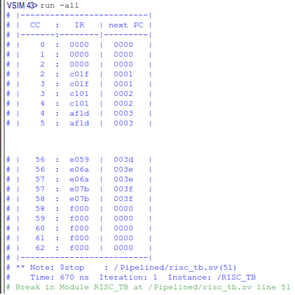
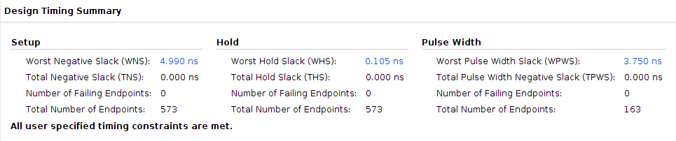
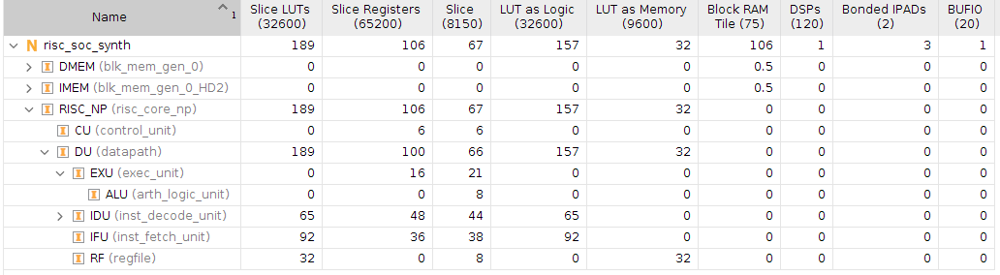

# 16-bit-RISC-processor-core
This project's primary motivation and objective is to understand the process, complexity, and challenges involved in pipelining a processor. Initially, a 16-bit RISC microprocessor based on a simplified version of the MIPS architecture was developed utilizing Harvard memory architecture. Afterward, a 4-stage pipeline was introduced, and pipeline registers were added to improve the processor's performance. A data forwarding unit was designed and integrated to address data dependencies.

# ISA instruction table
The ISA of this processor consists of 16 instructions with a 4-bit fixed size operation code. The instruction words are 16-bits long. There are 16, 16-bit wide architected register available.

|Operation               | OP-code  | 15 14 13 12 | 11 10 9 8 | 7 6 5 4 | 3 2 1 0 | comment                              |
|------------------------|----------|-------------|-----------|---------|---------|--------------------------------------|
|ADDition                | ADD      |      0      |     rd    |   rs1   |   rs2   | rd <= rs1 + rs2                      |
|SUBtraction             | SUB      |      1      |     rd    |   rs1   |   rs2   | rd <= rs1 - rs2                      |
|bitwise AND             | AND      |      2      |     rd    |   rs1   |   rs2   | rd <= rs1 & rs2                      |
|bitwise OR              | OR       |      3      |     rd    |   rs1   |   rs2   | rd <= rs1 | rs2                      |
|bitwise XOR             | XOR      |      4      |     rd    |   rs1   |   rs2   | rd <= rs1 ^ rs2                      |
|bitwise NOT             | NOT      |      5      |     rd    |   rs1   |    0    | rd <= ~ rs1                          |
|Arithmetic Shift Left   | SLA      |      6      |     rd    |   rs1   |    0    | rd <= rs1 << 1                       |
|Arithmetic Shift Right  | SRA      |      7      |     rd    |   rs1   |    0    | rd <= rs1 >> 1                       |
|Branch if Less than Zero| BLZ      |      8      |     rs1   | offsetH | offsetL | if rs1 < 0 : PC <= PC + 1 + offset   |
|unconditional Jump      | JMP      |      9      |     0     | offsetH | offsetL | PC <= PC + 1 + offset                |
|Jump And Link           | JAL      |      A      |     rd    | offsetH | offsetL | rd <= PC + 1 ; PC <= PC + 1 + offset |
|RETurn                  | RET      |      B      |     0     |   rs1   |    0    | PC <= rs1                            |
|Load Immidiate          | LI       |      C      |     rd    |  immH   |  immL   | rd <= Immediate value                |
|Load Word               | LW       |      D      |     rd    |   rs1   |    0    | rd <= Mem[rs1]                       |
|Store Word              | SW       |      E      |     0     |   rs1   |   rs2   | Mem[rs1] <= rs2                      |
|HaLT                    | HLT      |      F      |     0     |   0     |    0    | suspend operation                    |
--------------------------------------------------------------------------------------------------------------------------

# Comparisons
## Performance
A clock cycle counter was utilized to measure the number of cycles taken by both designs to execute identical code until reaching the halt instruction.

|         **Non-pipelined**             |          **Pipelined**           |
|---------------------------------------|----------------------------------|
|  |  |

## Timing
The Pipelined design achivied 238MHz max frequency and the pipelined design achived 250MHz.

## Power
### for 100MHZ
**Non-pipelined** 

**Pipelined** 

### for FMAX
**Non-pipelined** 

**Pipelined** 

### for 100MHZ
**Non-pipelined** 

**Pipelined** 

### for FMAX
**Non-pipelined** 

**Pipelined** 

## Utilization
### for 100MHZ
**Non-pipelined** 

**Pipelined** 

### for FMAX
**Non-pipelined** 

**Pipelined** 

